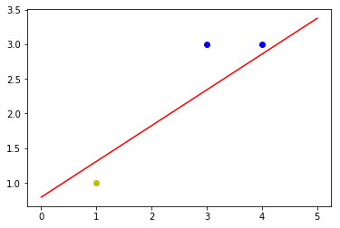

# 单层感知器

`神经网络`

---

### 定义
具有单层计算单元的神经网络系统，称为$Single\ Layer\ Perceptron$（单层感知器）。感知器的学习规则规定：**学习信号**等于**神经元期望输出**与**实际输出**之差。

$$
\begin{equation}
r = d _j - o _j
\end{equation} \tag{1}
$$

式$(1)$中，$d_j$为期望的输出，实际的输出为$o _j=f(\mathbf{W} _j^T\mathbf{X})$ 。感知器采用了符号函数作为转移（激活）函数，其表达为：

$$
\begin{equation}
f\left( {{\mathbf{W}} _j^T{\mathbf{X}}} \right) = \operatorname{sgn} \left( {{\mathbf{W}}  _j^T{\mathbf{X}}} \right) =
\begin{cases}
  \ {\kern 1pt} {\kern 1pt} \ 1,\ {\mathbf{W}} _j^T{\mathbf{X}} \ge 0 \\\\
   -1,\ {\mathbf{W}} _j^T{\mathbf{X}} < 0
\end{cases}
\end{equation} \tag{2}
$$

因此，权值调整公式应为：

$$
\begin{equation}
\Delta\mathbf{W} _j=\eta[d _j-\operatorname{sgn}(\mathbf{W} _j^T\mathbf{X})] \mathbf{X}
\end{equation} \tag{3}
$$

式$(3)$中， $\Delta\mathbf{W}_j$ 为权值向量的调整量，$\eta$为学习速率。

式$(3)$中，当实际输出与期望值相同时，权值不需要调整；在有误差的情况下，由于 $d_j$ 和 $\operatorname{sgn}(\mathbf{W}_j^T\mathbf{X}) \in \lbrace { - 1,1} \rbrace$，

权值调整公式可简化为：
$$
\begin{equation}
\Delta\mathbf{W}_j=\pm2\eta\mathbf{X}
\end{equation} \tag{4}
$$

感知器学习规则**只适用于二进制神经元，初始权值可取任意值**。
感知器学习规则属于一种监督学习。由于感知器理论是研究其他神经网络的基础，该规则对于神经网络的监督学习具有极为重要的意义。

### 实例

假设平面坐标系上有三个点，$(3,3)$，$(3,4)$这两个点的标签为$1$，$(1,1)$这个点的标签为$-1$，构建神经网络来进行分类。由于要分类的是二维数据，所以只需要$2$个输入节点，可以将神经元的偏置值也设置成一个节点，这样就需要$3$个输入节点。

输入数据有$3$个$(1,3,3)$，$(1,4,3)$，$(1,1,1)$，对应的标签为$(1,1,-1)$。
初始化权值$w _0$，$w _1$，$w _2$，取$-1$到$1$的随机数，学习率($learning\ $ $rate$ 设置为 $0.11$ ），激活函数为 $\operatorname{sgn}$ 函数。

 

<b>分类结果</b>

 
